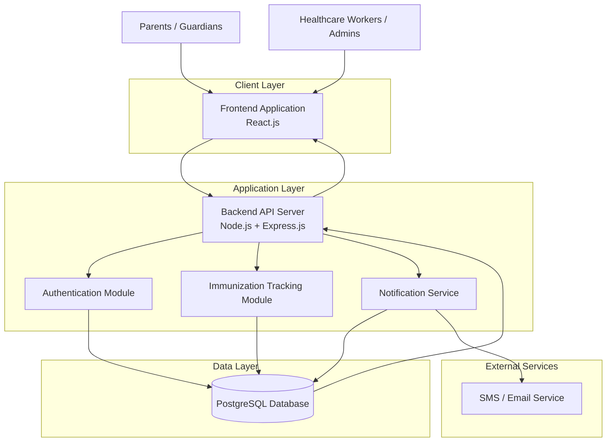
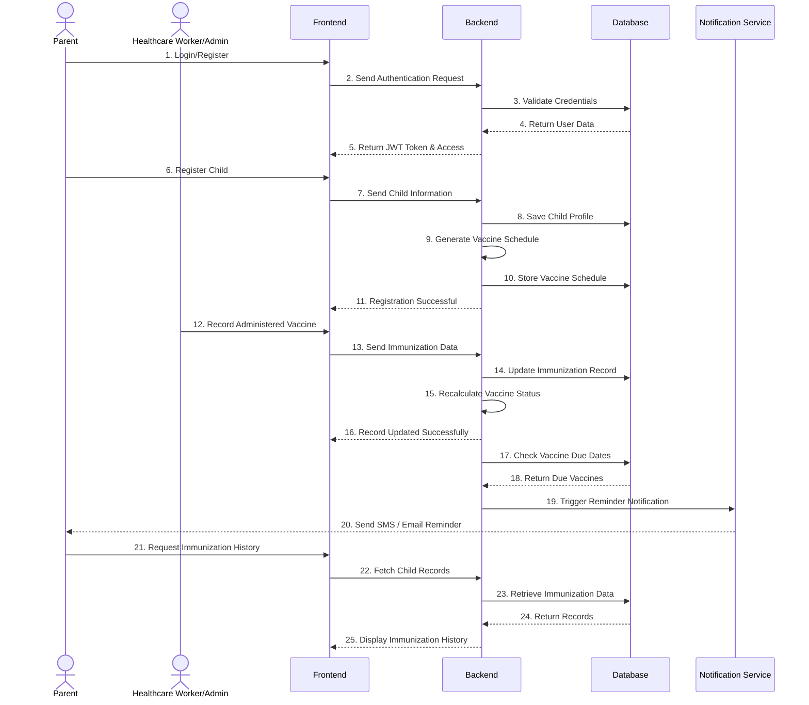
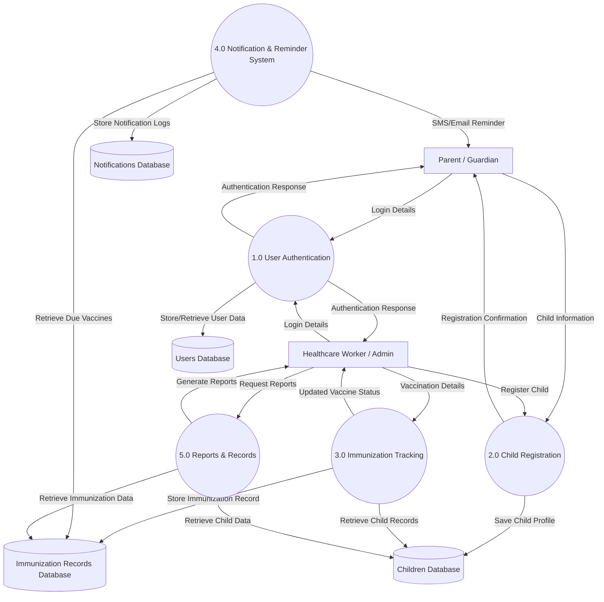
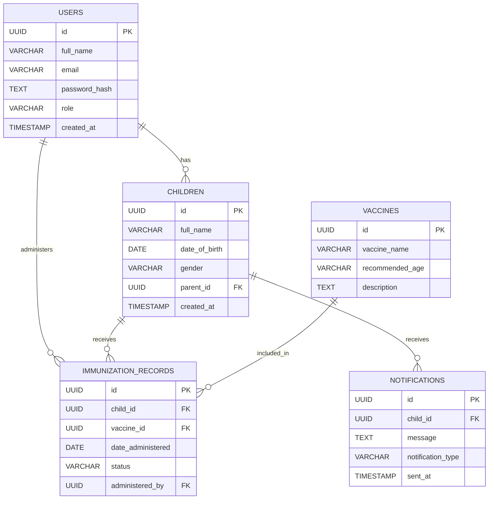

# Child Immunization Tracking System (CITS)

A digital platform for tracking and managing child vaccination records, designed for healthcare providers, parents, and health administrators.

---

# 1.) Project Overview

The **Child Immunization Tracking System (CITS)** helps healthcare institutions and parents monitor children's immunization schedules, maintain digital vaccination records, and receive automated reminders for upcoming vaccines.

The system aims to improve vaccination coverage, reduce missed immunizations, and support efficient healthcare management.

###  Objectives

- Digitize child immunization records
- Track vaccination schedules
- Send reminders for upcoming vaccines
- Improve healthcare reporting and monitoring
- Reduce missed or delayed vaccinations
- Provide centralized access to vaccination data

### Target Users

| User Role | Description |
|---|---|
| Admin | Manages the system and users |
| Healthcare Worker | Records vaccinations and manages child data |
| Parent/Guardian | Views child vaccination records and reminders |

---

# 2.) Core Features

### User Authentication & Authorization
Supports secure login and access control for:
- Admin (Doctors/Healthcare Workers)
- Parents/Guardians

#### Features
- User registration and login
- JWT authentication
- Password encryption
- Role-based access control

#### Admin Functions
- Manage child records
- Update vaccination records
- View reports

#### Parent Functions
- Register children
- View vaccination history
- Receive reminders

### Child Registration & Profile Management
Allows creation and management of child profiles.

#### Features
- Add and edit child profiles
- Generate unique child ID
- Store parent information

#### Child Information
- Full Name
- Date of Birth
- Gender
- Parent/Guardian Details
- Contact Information

### Immunization Tracking System
Tracks vaccination schedules and immunization history.

#### Features
- Record administered vaccines
- Track pending and completed vaccines
- Monitor missed vaccines
- Automatic schedule calculation

#### Vaccine Status
- Pending
- Completed
- Missed
- Upcoming

### Notifications & Reminder System
Sends reminders to parents about upcoming vaccines.

#### Features
- SMS notifications
- Email reminders
- Due date alerts
- Missed vaccine alerts

### Reports & Analytics
Provides basic immunization reports for admins.

#### Features
- Vaccination reports
- Defaulter tracking
- Monthly summaries
- PDF/CSV export

---

# 3.) Technology Stack
The Child Immunization Tracking System is built using modern web technologies to ensure scalability, security, performance, and ease of maintenance. The system follows a client-server architecture with separate frontend and backend services connected through RESTful APIs.

The selected technologies are lightweight, developer-friendly, and suitable for handling authentication, immunization records, notifications, and reporting functionalities efficiently.

## Frontend Technologies
The frontend provides the user interface for parents and healthcare workers.

### Technologies
- React.js
- Tailwind CSS
- Axios
- React Router

### Purpose
- Build responsive user interfaces
- Manage application routing
- Connect frontend to backend APIs
- Improve user experience across devices

## Backend Technologies
The backend handles business logic, authentication, APIs, and data processing.

### Technologies
- Node.js
- Express.js
- JSON Web Token (JWT)
- bcrypt

### Purpose
- Build RESTful APIs
- Handle authentication and authorization
- Manage server-side operations
- Secure user data

## Database & Deployment Technologies
These technologies manage data storage, hosting, and deployment.

### Technologies
- PostgreSQL
- Docker
- GitHub Actions
- Render / Railway

### Purpose
- Store application data securely
- Support database management
- Enable containerization
- Automate deployment workflows

---

# 4.) Immunization Schedule Tracking Logic
The system tracks immunization schedules using the child’s **Date of Birth (DOB)** and a predefined vaccination timetable.
Each vaccine in the database contains:
- Vaccine name
- Recommended age
- Dose number
- Schedule interval

When a child is registered, the system automatically calculates all vaccine due dates based on the child’s DOB.

## How the Tracking Works

### Child Registration
When a child profile is created:
- The system saves the child’s DOB
- The system generates a vaccination schedule automatically

Example:
| Vaccine | Recommended Age | Due Date |
|---|---|---|
| BCG | At birth | DOB |
| OPV 1 | 6 weeks | DOB + 6 weeks |
| Pentavalent 1 | 6 weeks | DOB + 6 weeks |

### Vaccine Status Monitoring
The system compares:
- Current date
- Vaccine due date
- Vaccination completion status

Based on this comparison, the vaccine status becomes:
| Status | Condition |
|---|---|
| Upcoming | Due date is approaching |
| Pending | Due date reached but not taken |
| Completed | Vaccine has been administered |
| Missed | Due date passed without vaccination |

### Recording Immunization
When a healthcare worker administers a vaccine:
- The vaccine is marked as **Completed**
- Date administered is stored
- Next vaccine schedule is updated automatically

### Reminder System
The system sends reminders to parents:
- Before vaccine due date
- On due date
- After missed vaccination date

Notifications can be sent through:
- SMS
- Email

### Schedule Calculation Logic
The system uses age intervals such as:
- Birth
- 6 weeks
- 10 weeks
- 14 weeks
- 6 months
- 9 months
These intervals are added to the child’s DOB to determine vaccine due dates automatically.

---

# 5.) System Architecture Overview
The Child Immunization Tracking System follows a three-tier architecture consisting of the Client Layer, Application Layer, and Data Layer. These components work together to manage child immunization records, vaccination schedules, and notifications efficiently.

### **Client Layer (Frontend)**
The client layer is the part of the system used by parents and healthcare workers through a web browser or mobile device.

It allows users to register, log in, register children, view immunization records, and receive vaccination reminders. The frontend communicates with the backend through RESTful APIs.

The frontend is developed using React.js and Tailwind CSS.

### **Application Layer (Backend)**
The application layer handles the core business logic of the system. It processes requests from the frontend, validates data, manages authentication, and communicates with the database.

The backend is also responsible for generating vaccine schedules based on a child’s date of birth, tracking vaccine status, and sending reminders for upcoming or missed vaccinations.

The backend is built using Node.js and Express.js.

### **Data Layer (Database)**
The data layer stores all system information, including user accounts, child profiles, vaccine schedules, immunization records, and notifications.

PostgreSQL is used as the database management system because it provides reliable and secure storage for structured data.

### **System Data Flow**
When a user performs an action on the frontend, such as registering a child, the request is sent to the backend. The backend processes the request and stores or retrieves data from the database.

After a child is registered, the system automatically generates vaccine schedules using the child’s date of birth. The system continuously checks vaccine due dates and updates vaccine statuses as completed, pending, upcoming, or missed.

The notification service sends reminders to parents when vaccines are due or missed.

### **Security**
The system secures user data using password hashing, JWT authentication, and role-based access control.

Parents can only access their own child’s records, while healthcare workers have permission to manage immunization data.

All communication between the frontend and backend is secured using HTTPS.

## System Architecture Diagram

## System Flow(Runtime Behaviour)


## Data Flow Diagram(DFD) Level 1

---

# 7. 🗄️ Database Design

The database is designed to store and manage all information related to users, children, vaccines, immunization records, and notifications. The system uses a relational database structure to maintain data consistency and support secure record management.

PostgreSQL is used as the database management system because it provides reliable storage, strong relational support, and efficient querying for structured healthcare data.

---

# Database Tables

## 1. Users Table

The Users table stores information for all system users, including healthcare workers and parents.

| Column | Type | Description |
|---|---|---|
| id | UUID | Unique user identifier |
| full_name | VARCHAR | User full name |
| email | VARCHAR | User email address |
| password_hash | TEXT | Encrypted password |
| role | VARCHAR | User role (Admin or Parent) |
| created_at | TIMESTAMP | Account creation date |

---

## 2. Children Table

The Children table stores child profile information and links each child to a parent account.

| Column | Type | Description |
|---|---|---|
| id | UUID | Unique child identifier |
| full_name | VARCHAR | Child full name |
| date_of_birth | DATE | Child date of birth |
| gender | VARCHAR | Child gender |
| parent_id | UUID | Linked parent account |
| created_at | TIMESTAMP | Registration date |

---

## 3. Vaccines Table

The Vaccines table stores predefined vaccine information and recommended schedules.

| Column | Type | Description |
|---|---|---|
| id | UUID | Unique vaccine identifier |
| vaccine_name | VARCHAR | Vaccine name |
| recommended_age | VARCHAR | Recommended vaccine age |
| description | TEXT | Vaccine description |

---

## 4. Immunization Records Table

The Immunization_Records table stores vaccination history for each child.

| Column | Type | Description |
|---|---|---|
| id | UUID | Unique record identifier |
| child_id | UUID | Linked child profile |
| vaccine_id | UUID | Linked vaccine |
| date_administered | DATE | Date vaccine was given |
| status | VARCHAR | Vaccine status |
| administered_by | UUID | Healthcare worker ID |

### Vaccine Status Values

- Pending
- Completed
- Missed
- Upcoming

---

## 5. Notifications Table

The Notifications table stores reminder and alert records sent to parents.

| Column | Type | Description |
|---|---|---|
| id | UUID | Unique notification identifier |
| child_id | UUID | Linked child profile |
| message | TEXT | Notification content |
| notification_type | VARCHAR | SMS or Email |
| sent_at | TIMESTAMP | Date notification was sent |

---

# Database Relationships

The database tables are connected using foreign keys to maintain relationships between records.

- A parent can have multiple children.
- A child can have multiple immunization records.
- Each immunization record is linked to a vaccine.
- Notifications are linked to child records.

---

# Database Design Benefits

The database structure supports:

- Secure data storage
- Efficient data retrieval
- Easy vaccine tracking
- Scalable record management
- Consistent relationship handling

---
## Database Entity Relationship Diagram

---
# 8. 🔐 Roles & Permissions

The system uses Role-Based Access Control (RBAC) to manage access to features and protect sensitive immunization data. Each user is assigned a role that determines the actions they can perform within the system.

The two main roles in the system are:

- Admin (Healthcare Worker)
- Parent/Guardian

---

# 1. Admin (Healthcare Worker)

Admins are responsible for managing child immunization records and monitoring vaccination activities within the system.

### Permissions

- Register and manage child records
- Record administered vaccines
- Update immunization status
- View all child immunization records
- Generate reports and statistics
- Send vaccination reminders
- Manage vaccine schedules

---

# 2. Parent / Guardian

Parents or guardians can manage and monitor their child’s vaccination information.

### Permissions

- Register children
- View child profiles
- View vaccination history
- Track upcoming vaccines
- Receive reminders and notifications
- Access only their child’s records

---

# Access Control Rules

The system restricts access based on user roles to ensure data privacy and security.

| Feature | Admin | Parent |
|---|---|---|
| User Authentication | ✅ | ✅ |
| Register Child | ✅ | ✅ |
| View Child Records | ✅ | Own Records Only |
| Record Vaccination | ✅ | ❌ |
| Manage Vaccine Status | ✅ | ❌ |
| View Reports | ✅ | ❌ |
| Receive Notifications | ❌ | ✅ |

---

# Security Enforcement

Role permissions are enforced at the backend using JWT authentication and protected API routes. Unauthorized users cannot access restricted resources or perform unauthorized actions.

---

# 9. Evaluation Metrics
The system is evaluated using key measurable metrics that assess accuracy, performance, reliability, and real-world impact on immunization tracking.

### Vaccine Schedule Accuracy (%)
Measures how correctly the system generates vaccination schedules based on a child’s Date of Birth compared to standard immunization guidelines. It ensures vaccine timelines are correctly calculated.

## Notification Delivery Success Rate (%)
Measures how many vaccination reminders are successfully delivered to parents via SMS or email. It evaluates the reliability of the reminder system.

```text id="n8k3qp"
Success Rate = (Delivered notifications / Sent notifications) × 100
```

### Immunization Completion Rate Improvement (%)
Measures how much the system improves vaccination completion compared to manual tracking. It shows the real-world impact of the system.
```text id="c9m2zd"
Improvement = After system usage − Before system usage
```

### System Response Time
Measures how fast the system responds to user actions such as login, child registration, and fetching records. Lower time means better performance.

### Notification Delivery Time (Latency)
Measures the time taken for a reminder to reach a parent after being triggered. It ensures timely vaccine alerts.

### Authentication Success Rate (%)
Measures the reliability of login and authentication processes. It checks how often valid users successfully log in.

### Data Integrity Error Rate (%)
Measures how often data errors or inconsistencies occur in the database. Lower values indicate better data reliability.

###  System Uptime (%)
Measures system availability over time. It ensures the system is accessible when needed without downtime.

### User Task Completion Time
Measures how long users take to complete tasks like registering a child or recording vaccination. It evaluates usability and efficiency.


